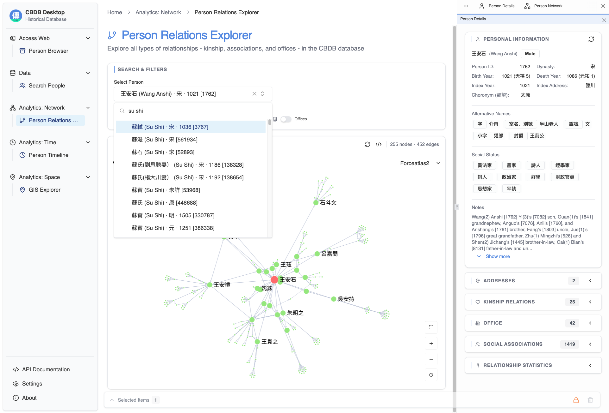

# Welcome to CBDB Desktop & Web 2025.0520.0.1.0

A new free and open-source interface for the China Biographical Database

**Live Demo: [dh-tools.com/cbdb](https://dh-tools.com/cbdb)**

**Download: [macOS (Apple Silicon)](https://github.com/boan-anbo/cbdb-web/releases/latest)**

> [!CAUTION]
> **Technology Demonstration - MVP Stage (As of September 29, 2025)**
>
> This is a tech demo showcasing web technologies for using CBDB and providing a foundation for an analytics platform built on a newly designed data access layer.

*CBDB Desktop & Web 2025.0520.0.1.0 - Demo Interface*

## Attribution

**China Biographical Database (CBDB)** is a project started by Robert M. Hartwell and Michael A. Fuller and is currently owned and maintained by teams at Harvard University, Academia Sinica, and Peking University. The CBDB data is licensed under CC BY-NC-SA 4.0.

This application includes the latest CBDB SQLite database (version 2025-05-20) from the [CBDB SQLite project](https://github.com/cbdb-project/cbdb_sqlite).

Learn more: [https://projects.iq.harvard.edu/cbdb](https://projects.iq.harvard.edu/cbdb)

---

## What is CBDB Desktop & Web?

CBDB Desktop & Web is a free and open-source interface (AGPL-3.0 license for the software) built with web technology that provides new ways to use the China Biographical Database. CBDB Web is the same interface but a hosted version at [dh-tools.com/cbdb](https://dh-tools.com/cbdb).

## Key Capabilities

This tech demo demonstrates that these capabilities are achievable:

- **Offline-first desktop application** with bundled database, ready to use (bundle size ~312MB, half of which is the embedded CBDB database)
- **Recreation of CBDB Access version** features with modern web technologies
- **Infrastructure for analytics features** such as network analysis, timeline visualization, and GIS
- **A new data layer** (see details below) providing a solid foundation for future integrations including with LLMs
- **Documented local REST API** for programmatic access
- **Cross-platform support** (Windows, macOS, Linux)
- **Support for cross-system interoperability** with research software such as Zotero

## Platform Availability

Currently, only the **macOS (ARM/Apple Silicon)** version is available for download from the [Releases](https://github.com/boan-anbo/cbdb-web/releases/latest) page. Windows, Linux, and Intel Mac versions will be made available in future releases.

## Prior Work

- **CBDB Access Version** by Michael A. Fuller ([Installation Guide](https://projects.iq.harvard.edu/files/chinesecbdb/files/cbdb_standalone_installation_instruction_v20211010.pdf)):
  This project learned from Professor Fuller's interface design and studied portions of the Visual Basic source code to understand core business logic. If possible, this project will help to recreate the entire Access interface and all of its features and analytics capabilities. The extracted VB source code from the Access version is provided in the [`access_restored`](./access_restored) folder for archiving and study purposes.
- **CBDB Online PHP Version** ([GitHub](https://github.com/cbdb-project/cbdb-online-main-server)):
  This project also learned from the API design and aims to achieve parity with the PHP server version of CBDB.

## What's New in CBDB Desktop & Web

CBDB Desktop & Web introduces significant architectural and conceptual improvements:

- **Future-Proof Tech Stack & Contract-Driven Development**:
  A unified TypeScript/JavaScript stack across frontend, backend, and shared contracts within a monorepo structure, ensuring longevity through mature open-source technologies and implementation flexibility via stable interfaces.

- **Four-layer Data Modeling**:
  A systematic approach to data modeling that creates standard models for core entities, achieving what the Access version attempted with denormalized tables.

- **Standard and Modular API Design**:
  External systems can rely on standard data shapes rather than raw table structures. The modularized API allows flexible composition with interactive documentation.

- **Extensive Testing**:
  Basic test coverage is already in place to ensure data stability and correctness across the entire stack. For example, tests validate data mapping accuracy against official CBDB sources, verify API compatibility with the PHP service, and ensure consistent behavior across different graph traversal depths. These serve as living documentation and provide confidence during refactoring. Integration tests use real CBDB data to validate complex queries. Future work includes comprehensive Access parity tests.

> [!TIP]
> **For detailed technical information about these features, please visit our full documentation on the welcome page at [dh-tools.com/cbdb](https://dh-tools.com/cbdb).**

## Next Steps

- Reproduce the classic Access experience (feature parity over time)
- Domain-specific analytics capabilities based upon user feedback and use cases
- Integrations with LLMs for AI assistance
- ... and more

## Created by

Bo An <bo.an@aya.yale.edu>

**Last updated:** September 29, 2025
